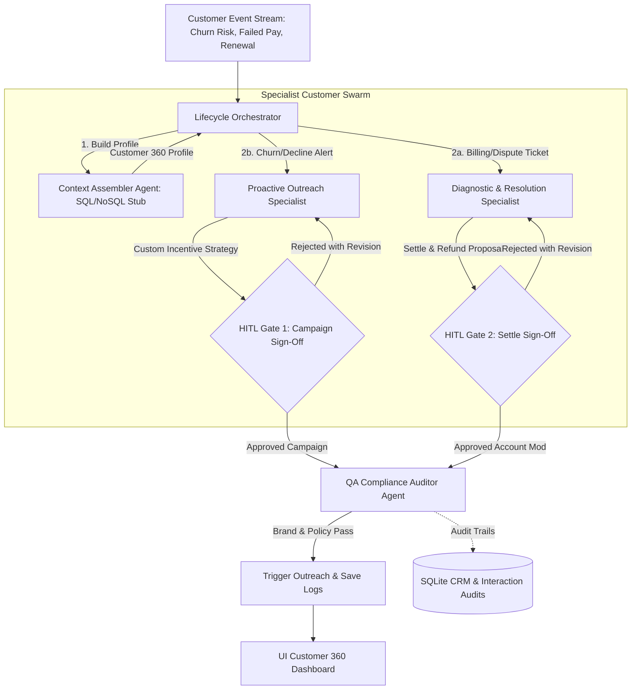
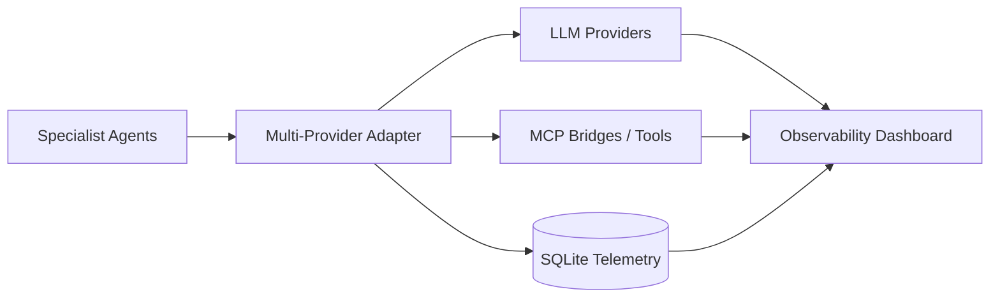

# 🚀 oneserv-agent — Customer Lifecycle Agent Swarm + Multi-Provider MCP Control Plane

`oneserv-agent` is an advanced customer lifecycle agent swarm platform. Instead of a basic reactive chatbot, it functions as an automated customer-relationship nervous system.

By listening to raw enterprise event streams (e.g. low software engagement alerts, failed billing transactions), the platform coordinates specialized agents to compile 360-degree profiles, draft custom outreach strategies, resolve invoice disputes, and run real-time compliance audits—enforcing strict manual human approval controls over outbound communications and ledger write-offs.

On top of the swarm, the platform ships a **live multi-provider & MCP observability control plane**: operators can see which LLM each specialist agent is bound to, watch MCP bridge health and tool calls, and inspect invocation telemetry as pipelines run.

---

## 📊 Dashboard Gallery

The console has two primary views — **Observability** (default) and **Lifecycle Swarm** — behind a single dark-mode control plane.

### Observability — providers, agents & MCP bridges

Live KPIs for providers online, agent invocations, MCP bridges connected, and tool-call volume. Control actions include health checks, bridge pings, agent rebinding, and **Simulate Agent Traffic**.


### Observability — streams & event log

Agent invocation history (provider, model, latency, tokens), MCP tool-call stream, and a unified observability event log.


### Lifecycle Swarm — customer 360 & HITL gates

Customer registry, event triggers, swarm progress stepper, human-in-the-loop review panels, real-time agent traces, and intervention history.


_Original overview capture:_


---

## 🔭 Multi-Provider & MCP Observability

### What it does

| Panel | What you see / do |
|-------|-------------------|
| **LLM Providers** | Mock, OpenAI, Anthropic, xAI — status, model, region, avg latency, request/error/token counts, capability tags. One-click **Health** ping per provider or **Health Check All**. |
| **Agent → Provider bindings** | Assembler, Proactive, Diagnostics, QA Compliance each bound to a provider. Rebind live from the UI; routing updates immediately for the next invocation. |
| **MCP Bridges** | SQLite CRM, Filesystem, Web Fetch, Slack Notify, Billing API — transport, endpoint, tool count, ping latency, call stats. **Ping**, **Connect**, or **Disconnect** each bridge. |
| **MCP Tool catalog** | Full `tools/list` across bridges with status and one-click **Call** probes. |
| **Agent Invocations** | Streaming table of agent completions (agent, provider, model, latency, tokens, status). |
| **MCP Tool Calls** | Streaming table of `tools/call` traffic (bridge, tool, agent, latency, status). |
| **Event stream** | Unified log of provider health, MCP pings, binds, pipeline triggers, invocations, and tool calls. |
| **Toolbar actions** | Health Check All · Ping MCP Bridges · Simulate Agent Traffic (fires a swarm pipeline + sample MCP probes). |

Every lifecycle swarm step is instrumented: the multi-provider adapter resolves the agent’s bound provider, runs the agent’s MCP tool route, records latency/tokens, and persists telemetry to SQLite for the dashboard.

### Multi-provider routing

- **Mode** (`ONESERV_PROVIDER_MODE`): `mock` | `multi` | `openai` | `anthropic` | `xai`
- Default **multi** mode binds specialists across providers (e.g. Assembler→Mock, Proactive→OpenAI, Diagnostics→Anthropic, QA→xAI).
- Without API keys, cloud providers run in **simulated** fallback (mock completions + realistic latency) so the control plane still demonstrates multi-provider routing end-to-end.

### MCP bridges (seeded)

| Bridge | Transport | Role |
|--------|-----------|------|
| `mcp-sqlite` | stdio | CRM profile, billing ledger, usage telemetry, audit traces |
| `mcp-filesystem` | stdio | Draft/artifact read-write for outreach & QA |
| `mcp-web` | SSE | Policy fetch & knowledge search for compliance context |
| `mcp-slack` | HTTP | Optional ops notifications (seeded disconnected) |
| `mcp-billing-api` | WebSocket | Ledger status / waiver mutations after Gate 2 |

Agent → MCP routes are predefined (e.g. Assembler hits SQLite tools; Proactive uses SQLite + filesystem + web; Diagnostics uses billing bridge; QA uses filesystem + web + audit).

---

## 📐 Swarm Architecture & Execution Nodes

The swarm shifts customer service from isolated support tickets to an end-to-end, multi-agent coordination graph:



### Observability data path



### Specialized Agents

1. **Context Assembler Agent**: Pulls data from mock fragmented tables (demographic profiles, ledger balances, product usage telemetry) to generate a cohesive Customer 360 profile — typically via SQLite MCP tools.
2. **Proactive Outreach Specialist**: Evaluates risk event streams (low logins, contract expirations) to design personalized retention discount structures.
3. **Diagnostic & Resolution Specialist**: Addresses billing errors, computing waiver adjustments or drafting dispute resolutions — can touch the Billing API bridge.
4. **QA Compliance Auditor Specialist**: Mandatory real-time audit on proposed outbound copy for professional, policy-compliant tone.

---

## 🚦 Dual-Gate Human-in-the-Loop Gating

To secure critical communications and safeguard enterprise finances, the pipeline pauses for manual supervisor review at two strict gates:

- **Gate 1: Outreach Campaign Verification** — Pauses after the **Proactive Specialist** drafts a promotion. Operators review discount values and outreach text, approve, or reject with revision notes.
- **Gate 2: Account Modification & Refund Sign-Off** — Pauses if the **Diagnostics Specialist** proposes a financial waiver. Billing supervisors must authorize ledger write-offs before completion.

---

## 📂 Project Structure

```
oneserv-agent/
├── config.py                  # Port, SQLite, multi-provider keys/models
├── database.py                # CRM / billing / interaction schemas
├── main.py                    # FastAPI: swarm + observability APIs
├── requirements.txt
├── static/                    # Control plane UI + screenshots
│   ├── index.html             # Observability + Lifecycle views
│   ├── app.css
│   ├── app.js
│   ├── dashboard.png
│   ├── dashboard 1.png
│   ├── dashboard 2.png
│   └── dashboard 3.png
├── services/
│   ├── adapters.py            # Multi-provider adapter + MCP tool routes
│   ├── providers.py           # Provider registry & health
│   ├── mcp_bridges.py         # MCP bridge/tool registry
│   ├── observability.py       # Invocation / MCP call telemetry
│   ├── orchestrator.py        # Lifecycle state machine
│   └── agents/                # Specialist prompts
├── test_swarm.py
└── README.md
```

### Observability API (subset)

| Method | Path | Purpose |
|--------|------|---------|
| GET | `/api/observability/summary` | Providers + MCP + invocation KPIs |
| GET | `/api/providers` | List LLM providers |
| POST | `/api/providers/health` | Ping all providers |
| POST | `/api/providers/{id}/health` | Ping one provider |
| GET | `/api/agents` | Agent → provider bindings |
| POST | `/api/agents/bind` | Rebind an agent to a provider |
| GET | `/api/mcp/bridges` | List MCP bridges |
| POST | `/api/mcp/bridges/ping` | Ping all bridges |
| POST | `/api/mcp/bridges/{id}/ping` | Ping one bridge |
| POST | `/api/mcp/bridges/{id}/status` | Connect / disconnect a bridge |
| GET | `/api/mcp/tools` | Catalog of tools across bridges |
| POST | `/api/mcp/call` | Invoke a tool on a bridge |
| GET | `/api/observability/invocations` | Agent invocation history |
| GET | `/api/observability/mcp-calls` | MCP call history |
| GET | `/api/observability/events` | Unified event stream |

### Lifecycle swarm API (subset)

| Method | Path | Purpose |
|--------|------|---------|
| GET | `/api/customers` | Customer 360 profiles |
| POST | `/api/trigger` | Start a swarm pipeline for an event |
| GET | `/api/interactions` | Intervention history |
| GET | `/api/interaction/{id}` | Case details + traces |
| POST | `/api/gate/decision` | HITL approve / reject at Gate 1 or 2 |

---

## 🛠 Tech Stack & Quickstart

- **Backend**: Python 3.11+, FastAPI, Uvicorn, SQLite
- **Frontend**: HTML5, CSS3 (Vanilla), JavaScript (ES6)
- **Control plane**: Multi-provider registry, MCP bridge registry, telemetry tables (`agent_invocations`, `mcp_calls`, `observability_events`)

### 🚀 Getting Started

1. **Install Dependencies**:
   ```bash
   pip install -r requirements.txt
   ```

2. **Launch the Server**:
   ```bash
   uvicorn main:app --port 8002 --reload
   ```

3. **Access the Console**:
   Open **[http://localhost:8002](http://localhost:8002)**

   - **Observability** (default): health-check providers, ping MCP bridges, rebind agents, or click **Simulate Agent Traffic**
   - **Lifecycle Swarm**: pick a customer (e.g. *TechStart Inc*), fire a Low Usage or Failed Payment alert, and walk HITL gates

Optional env for real providers (otherwise cloud providers use **simulated** fallback completions):

```bash
export ONESERV_PROVIDER_MODE=multi   # mock | multi | openai | anthropic | xai
export OPENAI_API_KEY=...
export ANTHROPIC_API_KEY=...
export XAI_API_KEY=...
```
