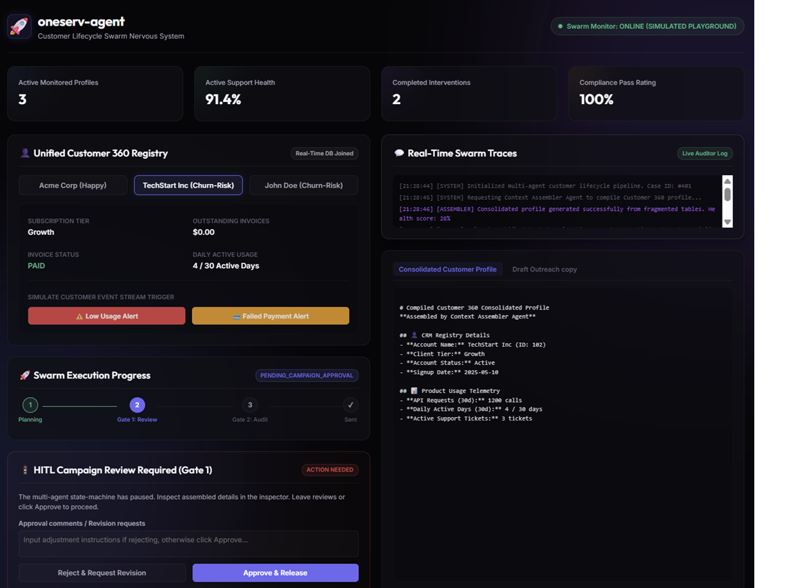
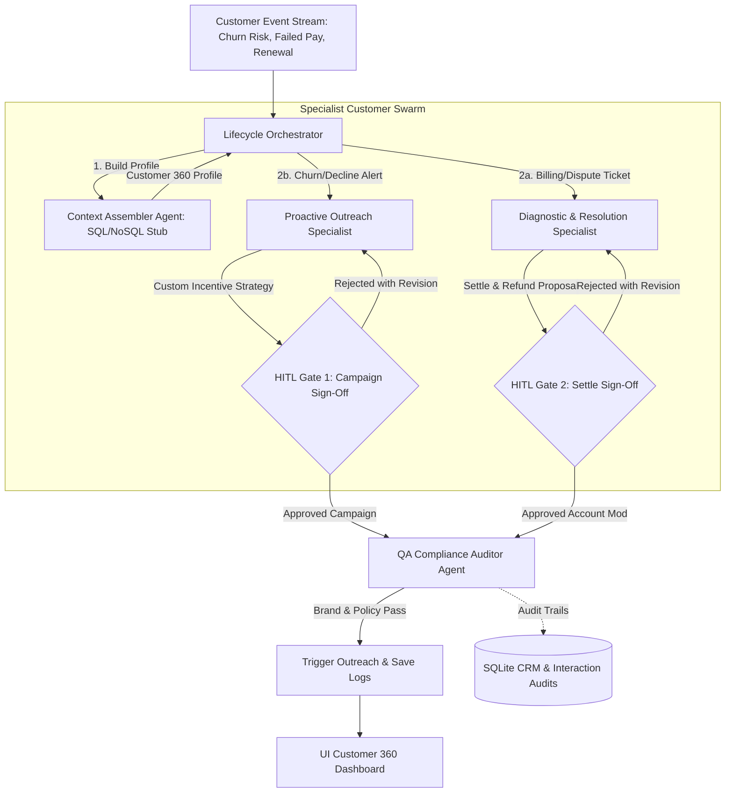

# 🚀 oneserv-agent — Customer Lifecycle Agent Swarm Nervous System

`oneserv-agent` is an advanced customer lifecycle agent swarm platform. Instead of a basic reactive chatbot, it functions as an automated customer-relationship nervous system. 

By listening to raw enterprise event streams (e.g. low software engagement alerts, failed billing transactions), the platform coordinates specialized agents to compile 360-degree profiles, draft custom outreach strategies, resolve invoice disputes, and run real-time compliance audits—enforcing strict manual human approval controls over outbound communications and ledger write-offs.

---

## 📊 Governance Console Dashboard

The system features a futuristic, responsive dark-mode executive console offering real-time progress indicators, customer billing ledger telemetry tables, streaming logs of active agent handoffs, and side-by-side file inspectors:



---

## 📐 Swarm Architecture & Execution Nodes

The swarm shifts customer service from isolated support tickets to an end-to-end, multi-agent coordination graph:



### Specialized Agents:
1. **Context Assembler Agent**: Pulls data from mock fragmented tables (demographic profiles, ledger balances, usage stats) to generate a cohesive Customer 360 profile.
2. **Proactive Outreach Specialist**: Evaluates risk event streams (low logins, contract expirations) to design personalized retention discount structures.
3. **Diagnostic & Resolution Specialist**: Addresses explicit billing errors, computing waiver adjustments or drafting dispute resolutions.
4. **QA Compliance Auditor Specialist**: Performs a mandatory real-time audit on all proposed outbound copies, ensuring a professional, polite, and policy-compliant tone.

---

## 🚦 Dual-Gate Human-in-the-Loop Gating

To secure critical communications and safeguard enterprise finances, the pipeline pauses for manual supervisor review at two strict gates:
- **Gate 1: Outreach Campaign Verification**: Pauses after the **Proactive Specialist** drafts a promotion. Operators can review the discount values and outreach text, approve the campaign, or reject it to request changes.
- **Gate 2: Account Modification & Refund Sign-Off**: Pauses if the **Diagnostics Specialist** proposes a financial waiver. The action halts until a billing supervisor authorizes writing off the ledger balance.

---

## 📂 Project Structure

```
/home/tanvir/oneserv-agent/
├── config.py             # App port and SQLite variables
├── database.py           # Fragmented SQL joins and automatic customer health scoring
├── main.py               # FastAPI routers and background threads
├── requirements.txt      # Dependencies
├── static/               # Control Plane Assets
│   ├── index.html        # Frosted glass panel registry
│   ├── app.css           # Styling rules
│   └── app.js            # Dispatching scripts
├── services/             # Orchestration layers
│   ├── __init__.py
│   ├── orchestrator.py   # State machine, trace loggers, and loopbacks
│   └── agents/           # Specialized agent prompt configurations
│       ├── __init__.py
│       ├── assembler.py
│       ├── proactive.py
│       ├── diagnostics.py
│       └── qa_compliance.py
├── test_swarm.py         # Swarm and database integration checks
└── README.md             # Multi-agent architectural specs
```

---

## 🛠 Tech Stack & Quickstart

- **Backend**: Python 3.11+, FastAPI, Uvicorn, SQLite
- **Frontend**: HTML5, CSS3 (Vanilla), JavaScript (ES6)

### 🚀 Getting Started

1. **Install Dependencies**:
   ```bash
   pip install -r requirements.txt
   ```

2. **Launch the Server**:
   ```bash
   uvicorn main:app --port 8002 --reload
   ```

3. **Access the Console**:
   Open **[http://localhost:8002](http://localhost:8002)** in your browser, select a customer (e.g. *TechStart Inc*), and trigger a mock event alert to see the Swarm coordinate!
